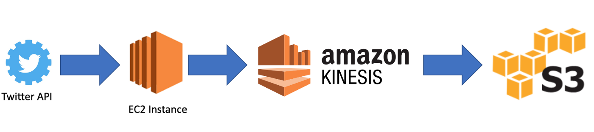

# Social Analysis with Twitter Data
### Data Engineering and AWS
### [Medium Article - How to Create a Dataset with Twitter and Cloud Computing](https://towardsdatascience.com/how-to-create-a-dataset-with-twitter-and-cloud-computing-fcd82837d313?source=friends_link&sk=b56db9035ff3e59a68fbc19fbf211539)

In this project I setup an ETL flow from the Twitter API to an S3 bucket. I use different services from AWS and I manipulated data by using Python and Shell languages.

